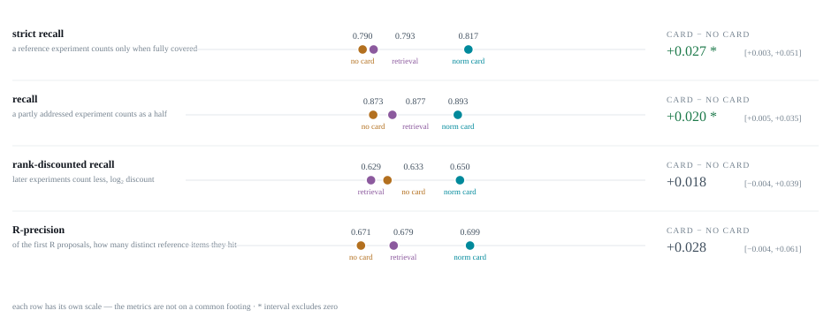
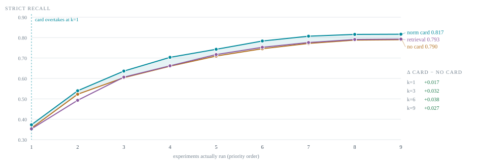
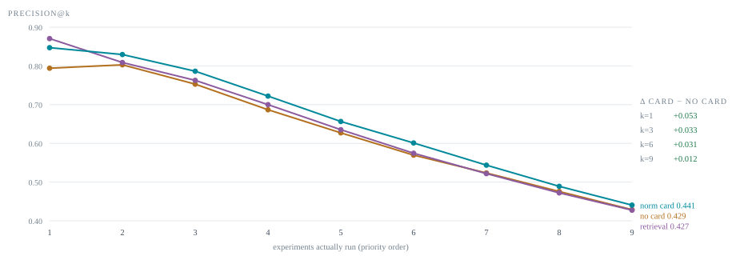
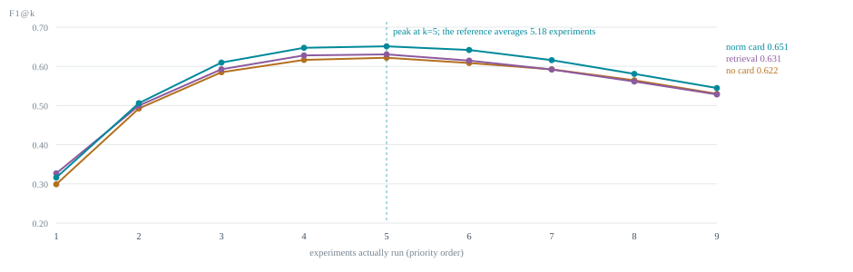
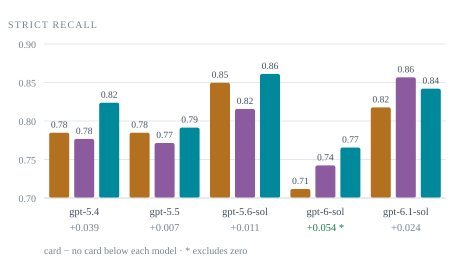
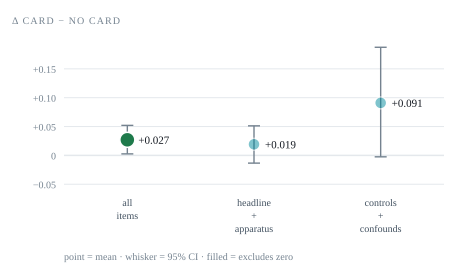

## Results

> The full interactive report, with every chart and the per-claim tables, is an artifact.
> What follows is a static copy: GitHub strips the JavaScript that draws the charts, so they
> are committed as SVGs under [`charts/`](charts) and the numbers are repeated as
> tables.

**34 claims x 5 proposer models x 3 conditions = 510 judged arms.** Each claim is scored only
against the reference experiments that decide it. The judge is `gpt-5.6-terra`, one pass per arm,
blind to which condition it is grading.

### Headline

**Strict recall** — a reference experiment counts only when the judge marks it fully covered,
because a half-addressed experiment is not something a downstream system can run.

| | no card | retrieval | norm card | card − no card |
|---|---|---|---|---|
| Strict recall | 0.790 | 0.793 | **0.817** | **+0.027 [+0.003, +0.052]** |
| Recall (partial counts a half) | 0.873 | 0.877 | 0.893 | +0.020 [+0.005, +0.035] |
| Rank-discounted recall | 0.633 | 0.629 | 0.650 | +0.018 [-0.004, +0.039] |
| R-precision | 0.671 | 0.679 | 0.699 | +0.028 [-0.004, +0.061] |

### Budget

Recall climbs with the budget and precision falls, so F1 peaks where they balance — at
**k = 5**, against a reference averaging 5.18 experiments. The best budget to give a
proposer is about the number of experiments the question actually needs. SciFy ships at three.

Of the first R slots (R = that claim's reference size), what each slot bought:

| | hits a **new** reference item | repeats one already hit | matches nothing |
|---|---|---|---|
| no card | 65.0% | 25.6% | 9.4% |
| retrieval | 67.7% | 24.2% | 8.1% |
| **norm card** | **68.5%** | **22.5%** | 9.0% |

The card's gain is almost entirely **less piling on**. The rate of spending a slot outside the
reference is flat across arms, so the card is not avoiding off-reference work — it is spreading
its early slots over more of what the claim needs.

### Precision, measured two ways

Precision here is a **maximum bipartite matching**: a proposal may be spent once and a reference
item filled once, so a second proposal doing a job the first already did earns nothing. Precision
against the whole nine-slot budget is not reported — the reference averages 5.18 experiments, so
that number is capped near 0.58 whatever the proposal does and measures the budget.

A **second judge that never sees the reference** then grades every proposed experiment on its own
merits, which is the only way to ask whether work the reference lacks is nonetheless good:

| share of proposed experiments | no card | retrieval | card | card − no card |
|---|---|---|---|---|
| worth a slot | 0.919 | 0.920 | 0.918 | -0.000 [-0.023, +0.024] |
| would decide the claim | 0.821 | 0.817 | 0.788 | **-0.033 [-0.056, -0.009]** |
| tangential | 0.028 | 0.038 | 0.051 | **+0.023 [+0.009, +0.038]** |
| irrelevant | 0.000 | 0.002 | 0.000 | +0.000 [+0.000, +0.000] |
| repeats an earlier one | 0.048 | 0.034 | 0.030 | -0.017 [-0.037, -0.000] |

**All three arms are equally precise.** What shifts is the mix: the card trades claim-deciding
experiments for tangential ones, while producing fewer repeats and almost no flawed work.

Of the experiments the reference does not contain at all, **78% of the card arm's still bear
on the claim** (86% unaided), so "unmatched" is not "wasted".

### Per model, and where the gain lives

### What to distrust

- References are model-written and **not reviewed by a person**.
- Splitting each paper's reference by claim is a judgement call, and it is the author's.
- Re-proposing against the rewritten claims lifted both unaided arms and left the carded arm
  unmoved, halving the effect — clearer claims may do some of the card's work. Not settled:
  the two runs use different proposal samples.
- One judge, one pass per arm, and the reference-blind auditor is the same base model.
