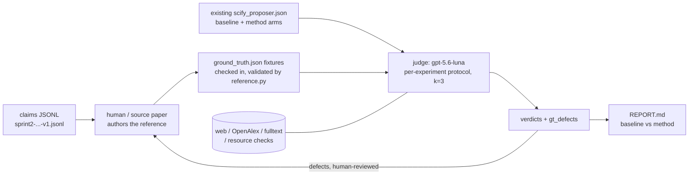

# Evaluation Harness v2 — Design

**Status:** implemented in `norm_cards/eval/`. This doc is the design of record; the
"Implementation notes" section at the end records what changed while building it.
**Supersedes:** `results/norm_cards_hybrid/ground_truth_recipes.md` (hand-written Fable-5
ground truths — scratched) and the manual scoring in `GRAND_REPORT_10claims.md`.

## Goal

An automated, evidence-grounded evaluation of the norm-card pipeline: score the
experiment sets produced by `scify_proposer.py` (baseline vs method arms, proposer =
gpt-5.5 or whatever the pipeline-under-test uses) for **coverage, correctness, and
groundedness** against the claim's true verify/refute decision structure — so that
pipeline changes can be measured as deltas on a fixed benchmark of 17 claims.

One agentic stage, over an input the harness does not produce:

| Piece | Model | Role |
|---|---|---|
| **Reference recipes** | none — **authored outside the harness** | The experiment chain a competent team would run to decide the claim. Hand-written, or transcribed from the source paper's experiment section. A checked-in fixture; `reference.py` validates and renders it. See `reference_format.md`. |
| **Evaluation** | `gpt-5.6-luna` (cheap/fast → judge-runs default 3) | For each proposed experiment, run a per-experiment evaluation protocol: triage against the reference, then independently investigate and issue an evidence-quoted verdict. Critical of **both** the proposal and the reference. |

**Scope for now:** the 10 claims that have `scify_proposer.json`
(6, 7, 9, 10, 11, 12, 21, 33, 36, 37); the evaluator runs on those existing outputs.
The harness is test-case shaped: claims with a reference fixture are the test set.

**Why the reference is not machine-generated.** An earlier version of this design had a
Stage A that ran `gpt-5.6-sol` at `xhigh` effort to research each claim and write its
reference recipe. That was removed in August 2026 after review: a reference produced by
asking a strong model to design experiments for the claim is not an independent
standard, it is one more system's output — and if that model were reliable enough to
define correctness, the right move would be to ship it as the proposer instead of
scoring the proposer against it. The circularity also caps the measurable ceiling of the
pipeline at the reference model's own judgment. References now come from a person or a
paper, and each carries a `provenance` block that is rendered into the line the judge
sees, so a weakly-sourced reference is visibly weak at the point of use.

Everything downstream already assumed a fallible reference, so this change is additive
rather than disruptive: the judge is still told the reference is orientation and not an
oracle, still forbidden from faulting a proposal on divergence alone, and still files
`gt_defects` against the reference.

## Core design principles

1. **The ground truth is a fallible first reference, not an oracle.** Whatever its
   provenance, a human is fallible too, and a reference transcribed from a paper carries
   only that paper's authority. The evaluator uses it for fast triage only. Any verdict that matters must be backed by
   *independent* evidence (paper quotes, docs, leaderboards) — "the GT says otherwise" is
   never sufficient on its own, except for the blatant-contradiction fast path (below).
   The evaluator can and should flag GT defects; these feed back into GT revision.
2. **Fully equipped, no compute/time budget.** Both agents get web search, page fetch,
   OpenAlex paper search, and full-text retrieval, with a very high tool-call ceiling.
   Thoroughness is the point; cost is accepted.
3. **Every judgment quotes evidence.** A verdict without a quoted, attributable source is
   downgraded to `UNSUPPORTED` and excluded from headline scores.
4. **Judge the decision structure, not string similarity.** A proposed experiment that
   differs from the GT but genuinely advances the verify/refute decision is a
   `VALID_NOVEL`, not a miss. Coverage is scored over *roles* in the dependency chain
   (gate → apparatus → headline → control), not over GT line items.
5. **Everything is auditable.** Full tool-call trajectories (every query, every fetched
   page, every quote) are logged as JSONL traces so any verdict can be hand-checked.

---

## Shared infrastructure

### `norm_cards/eval/agent_loop.py` — generic tool-calling loop

The judge's runner (litellm function-calling, consistent with
`llm.py`):

```
run_agent(system, user, submit_spec, model, *, reasoning_effort,
          max_steps=200, trace_path, validate) -> AgentResult
```

- Standard OpenAI-style tool-calling loop: model ↔ tool executor until the model emits
  the final structured answer (a designated `submit_*` tool with a strict JSON schema —
  this is how we force valid output without truncating the research phase).
- `max_steps` is a safety valve, not a budget — set high (200), never advertised to the
  model. No token/time pressure in any prompt.
- `validate` rejections are handed *back to the agent* as a tool result, so a schema or
  evidence-discipline failure produces a corrected resubmission instead of a dead run.
- Every step appended to `trace.jsonl` with the full tool result. Results are also cached
  to disk (keyed by tool+args hash) so re-runs are cheap and evidence is reproducible.
- **`reasoning_effort` is always passed explicitly.** Verified live: the API rejects
  function tools on `/v1/chat/completions` when the parameter is *omitted*, but accepts
  every explicit level including `xhigh`. Omitting it is the one way to break the loop.
- **Evidence ledger + context compaction.** A `record_evidence(source, quote, bearing)`
  tool captures quotes the moment they're found; the ledger is pinned in context and
  never compacted, while raw tool results older than the last 6 shrink to a head slice
  once the transcript passes ~400k chars. This is what makes long research runs possible
  without the agent losing the quote it read eighty steps ago — and it enforces the
  "quote evidence" rule mechanically rather than by asking nicely in a prompt.

### `norm_cards/eval/tools.py` — the tool belt

All tools are **local functions** exposed via function-calling, not provider-native
search. Rationale: (a) works identically for any model family, (b) every query and
result is logged and cacheable → auditable evidence trail, (c) no dependence on what a
given provider's built-in browsing returns on a given day.

| Tool | Backing | Purpose |
|---|---|---|
| `web_search(query, n)` | SERP API (key already used by `sources/serp_scholar.py`) | General web: docs, leaderboards, blog posts, HF/Kaggle dataset pages. |
| `fetch_page(url)` | requests + readability extraction | Read a page found via search; returns cleaned text. |
| `openalex_search(query, n, lexical=False)` | wraps `sources/openalex.py` (`search` / `search_lexical`) | Scholarly search: titles, abstracts, venues, citation counts, DOIs, OA pdf urls. |
| `fetch_paper(id_or_url)` | wraps `fulltext.py` + `.pdfcache` | Full text of a paper (pdf → text) for quote extraction. |
| `check_resource(name, kind)` | HF Hub / Kaggle / PapersWithCode APIs | Existence + metadata check for a named dataset/model/metric ("does `coco-person-640` exist? what is YOLO11n's reported AP?"). Used heavily for groundedness. |

"Deep search" is emergent: the loop iterates search → fetch → search as long as it
wants. No separate deep-research API dependency (can be added later behind the same
tool interface if wanted).

---

## The reference recipe (`norm_cards/eval/reference.py`)

**An input, not a stage.** The harness has no code path that writes a reference recipe;
it validates one, renders it, and shows it to the judge. See
[`reference_format.md`](reference_format.md) for the field-by-field spec.

```
python -m norm_cards.eval.reference --template 7   # blank skeleton for problem 7
$EDITOR results/eval_v2/ground_truth/problem_7/ground_truth.json
python -m norm_cards.eval.reference --check        # validate + render markdown
```

**Where references come from:** a person writes one, or transcribes it from the
experiment section of the paper the claim was drawn from, or takes dictation from a
domain expert. Each records this in `provenance`, which is rendered into a single line
shown to the judge alongside the recipe.

**Structure retained from the generated version** (it was the part that worked): the
dependency chain **gate** (cheap prerequisite that can refute outright) → **apparatus**
(things the claim presupposes; build + validate) → **headline** (direct test, all stated
constraints enforced) → **control** (rule out artifacts / attribute the effect). Target
size **4–6 experiments**, adaptive not fixed, refute-first: early steps are cheap kills;
each later step assumes the earlier ones didn't already refute, and builds toward
proving the claim when disproving it wasn't straightforward. Each step carries id, role,
description, pass/fail criteria, resources, dependencies, and evidence for why it is
necessary and standard. `confidence` and `caveats` per step, plus a `self_critique`
list, tell the judge how much of the reference to lean on — a weakness recorded there is
one a divergent proposal will not be unfairly punished for.

**Validation split.** `--check` reports **errors** that block evaluation (3–8 steps; a
`headline` and a `gate` present; every step has an id, valid role, real `pass_criteria`
and `why_necessary`; `depends_on` resolves; non-empty `decision_logic` and
`claim_analysis.assertions`) and **warnings** that never block (missing provenance, thin
citations, uncited steps, empty self-critique). The split is deliberate: the errors are
defects that would make a comparison meaningless, while the warnings are about how much
weight a reference can bear — and a hand-written reference and a paper-transcribed one
carry their authority differently, so neither should be blocked over the shape of its
bibliography.

**Files:** `results/eval_v2/ground_truth/problem_<id>/ground_truth.json` (the fixture)
and `ground_truth.md` (rendered by `--check`; what you actually read).

---

## The evaluator (`norm_cards/eval/evaluate.py`)

**Input per claim:** the claim, the GT fixture (with its confidence annotations), and
an experiment set to score — one evaluator run per arm, **baseline and method scored
separately** (`baseline_experiments` / `method_experiments` from the existing
`results/norm_cards_hybrid/problem_*/scify_proposer.json`; any future pipeline
variant's output plugs into the same interface). The eval loop **assumes the GT
exists** for every claim it is given and fails fast with a clear error if the fixture
is missing — it never generates or modifies GT itself. The evaluator is told
explicitly, in the system prompt: *the GT is LLM-generated and fallible; it is a
triage reference, not an authority; your verdicts must stand on independently quoted
evidence.*

### Per-experiment protocol (the core loop — runs once per proposed experiment)

1. **Normalize.** Extract from the prose: target subclaim, method, resources named
   (datasets/models/metrics), measurement, decision rule.
2. **GT triage.** Map to GT steps: `MATCH` (≈ a GT step), `PARTIAL`, `NOVEL` (no GT
   counterpart), `CONTRADICTS` (conflicts with a GT step's logic or facts).
3. **Route by triage:**
   - **Blatant-contradiction fast path.** If the experiment is *obviously* wrong on its
     face (tests the wrong quantity, ignores a stated constraint of the claim, cites a
     nonexistent resource) → reject without deep research, BUT the rejection must still
     quote the claim text or one verifying tool call (e.g. `check_resource` showing the
     dataset doesn't exist) — never solely "GT disagrees". Fast ≠ evidence-free.
   - **Match path.** Verify the match is real, then spot-check groundedness: do the
     named resources exist and behave as the experiment assumes (`check_resource`,
     `openalex_search`)?
   - **Divergent-but-plausible path (the expensive one — this is where the evaluator
     earns its keep).** Deep investigation: search the literature for whether this
     design is sound, whether the field actually does it this way, whether it
     measures what it says. Then judge its **decision value**: does it advance the
     overall verify/refute structure (fill a gate/apparatus/headline/control role),
     is it redundant with another proposed experiment, or is it orthogonal busywork?
     A sound novel experiment that improves on the GT ⇒ `ACCURATE` with `novel: true`
     **and** a recorded `gt_defect` (GT was missing it).
4. **Groundedness audit.** For every concrete resource named: exists? publicly
   available (HF/Kaggle as the proposer prompt requires)? appropriate for the stated
   use? Each check is a logged tool call.
5. **Verdict — 3-level rating**, one per experiment:

   | Verdict | Score | Meaning |
   |---|---|---|
   | `ACCURATE` | 1.0 | Conveys the correct thing — matches a GT step in substance, **or** is a sound novel design the evaluator has independently verified advances the verify/refute decision. |
   | `MIXED` | 0.5 | Right idea, imperfect execution — skipped a minor element, under-specified (metric/threshold/constraint left vague), or missing a secondary control. Would still produce useful signal. |
   | `IRRELEVANT` | 0.0 | Falls short — could go in a random direction and yield no useful information about the claim: tests the wrong quantity, ignores a stated constraint, ungrounded/nonexistent resources, or no bearing on the decision structure. |

   Plus orthogonal annotations (not part of the score, kept for diagnostics):
   `gt_triage` (MATCH/PARTIAL/NOVEL/CONTRADICTS), `novel: bool` (sound but absent
   from GT ⇒ also files a `gt_defect`), `redundant: bool` (duplicates another
   experiment in the same set ⇒ feeds the redundancy penalty).

   Every verdict carries: `evidence[]` (quotes with sources), `reasoning`,
   `evidence_tier`, and any `gt_defects[]`.

   **Evidence tiers:** T1 = quoted peer-reviewed paper (DOI/arXiv via
   openalex/fetch_paper); T2 = official docs, leaderboards, dataset cards; T3 = claim
   text or GT reference (fast path only); T0 = none ⇒ verdict auto-downgraded to
   `UNSUPPORTED` and flagged for hand review. Headline metrics count only T1/T2-backed
   verdicts (T3 allowed for the fast-reject path).

### Set-level scoring (per arm, per claim)

After all per-experiment verdicts, a final synthesis pass over the whole set:

- **Coverage** — of the decision structure's *roles*, judged functionally: is there a
  viable gate? apparatus validation? a headline test with the claim's constraints
  actually enforced? controls? Score = weighted role coverage (headline and gate
  weighted highest). GT steps the evaluator has flagged defective are excluded from
  the denominator.
- **Correctness** — mean verdict score (ACCURATE=1, MIXED=0.5, IRRELEVANT=0).
- **Groundedness** — fraction of named resources that pass the audit.
- **Redundancy/efficiency** — penalty for `redundant`-flagged items (will matter more
  once the ≤3 proposer cap is lifted; guards against gaming coverage by shotgunning).
- **Decision sufficiency** (the headline number) — evaluator's judgment: *if this
  experiment set were executed as written, would its outcomes verify or refute the
  claim?* {sufficient / sufficient-with-gaps / insufficient}, with the missing pieces
  named and evidence-backed.

**Output:** `results/eval_v2/judgments/problem_<id>/<arm>.json` + `trace.jsonl`:

```json
{
  "problem_id": "15", "arm": "baseline", "judge_model": "gpt-5.6-luna",
  "experiments": [
    {"index": 0, "normalized": {...}, "gt_triage": "PARTIAL",
     "verdict": "MIXED", "novel": false, "redundant": false, "evidence_tier": "T1",
     "evidence": [{"source": "...", "quote": "...", "bearing": "..."}],
     "reasoning": "...", "gt_defects": []}
  ],
  "set_scores": {"coverage": 0.75, "correctness": 0.67, "groundedness": 0.9,
                 "redundancy_penalty": 0.0, "decision_sufficiency": "sufficient-with-gaps",
                 "missing": ["no apparatus validation for the CVAE"]},
  "gt_defects": [{"gt_step": "A1", "defect": "...", "evidence": [...]}]
}
```

### Judge-reliability measures (the gpt-5.5-judge lesson)

- **Structured protocol over holistic scoring** — the judge never emits one big score;
  every number is a composition of small, individually evidenced decisions.
- **Mandatory evidence + audit trace** — makes hand-spot-checking cheap.
- **Self-consistency by default** — `--judge-runs k`, **default 3** (luna is cheap and
  fast): per-experiment verdicts are majority-voted; 3-way disagreements flagged
  `CONTESTED` for hand review rather than silently averaged.
- **Blind arms** — the judge is never told whether a set came from the baseline or the
  norm-card arm, nor that a second arm exists. Removes the obvious thumb on the scale.
- **Calibration set before trusting** — `calibrate.py --template` emits every judged
  experiment with a blank `expected_verdict`; hand-label ~10 (clearly valid / clearly
  invalid / subtle) *without reading what the judge said*, then `calibrate.py` reports
  agreement. Gate: don't trust a full run below 8/10 with every miss explainable.
- **GT-defect channel** — systematic under-scoring shows up as valid experiments
  marked `CONTRADICTS`; forcing the judge to either produce independent evidence or
  file a GT defect removes the "GT-said-so" shortcut that sank the gpt-5.5 judge.

---

## Proposer change (small, in `scify_proposer.py` — deferred)

Later, add an **uncapped variant** of `SYSTEM_PROPOSER`: "up to 3 experiments" → "as
many experiments as needed" (the GPU/runtime block is already stripped), selected via a
`capped: bool` arg and recorded in the output JSON. **For now the evaluator scores the
existing capped outputs** in `results/norm_cards_hybrid/problem_*/scify_proposer.json`
as-is; the uncapped re-run is a future pipeline iteration that plugs into the same
harness.

## Reporting (`norm_cards/eval/report.py`)

Aggregates all judgment files into `results/eval_v2/REPORT.md`:

- Per-claim table: arm × {coverage, correctness, groundedness, redundancy, sufficiency}.
- Baseline-vs-method deltas with per-claim breakdown (the pipeline-improvement signal).
- GT-defect digest (feeds GT regeneration).
- `CONTESTED`/`UNSUPPORTED` items listed for hand review.
- Run metadata: models, judge-runs k, prompt variant, date — so reports across pipeline
  iterations are comparable.

## Directory layout

```
norm_cards/eval/
  __init__.py       # paths, judge config, claim + reference fixture loading
  agent_loop.py     # tool-calling loop, evidence ledger, compaction, trace/cache
  tools.py          # web_search, fetch_page, openalex_search, fetch_paper, check_resource
  schemas.py        # submit_evaluation schema, its validator (evidence discipline),
                    #   and the reference-recipe input gate
  prompts.py        # the judge's system prompt (the real spec of its behaviour)
  scoring.py        # verdicts/statuses -> numbers; majority vote across judge runs
  reference.py      # reference recipes as INPUT: --template <id> | --check
  evaluate.py       # judge CLI:  -m norm_cards.eval.evaluate --problems ... [--arms] [--judge-runs k]
  calibrate.py      # judge-vs-hand-labels agreement check (--template to start)
  report.py         # aggregate -> REPORT.md
results/eval_v2/
  ground_truth/problem_<id>/{ground_truth.json, ground_truth.md}
  judgments/problem_<id>/{baseline.json, method.json, <arm>.run<k>.trace.jsonl}
  calibration.json
  REPORT.md
```

Judge traces and the tool cache are gitignored (megabytes each, regenerable);
references and judgments are tracked, and every judgment carries its own evidence
ledger, so verdicts stay auditable from git alone. `ground_truth/` keeps its directory
name so existing paths and fixtures do not churn, but its contents are inputs now.

`results/norm_cards_hybrid/` is left untouched as the v1 record.

## Execution flow



## Implementation notes (what building it changed)

1. **`reasoning_effort` must be sent explicitly on every tool-calling request.** Omitting
   it makes the API reject function tools on `/v1/chat/completions`; every explicit level
   through `xhigh` works fine. This is the single easiest way to break the loop.
2. **The evidence ledger became load-bearing, not decorative.** `record_evidence` exists
   because long runs must compact old page text out of context; pinning the ledger is
   what makes that safe, and it simultaneously turns "quote your evidence" from a prompt
   request into a mechanism.
3. **Validation is the enforcement point.** `schemas.validate_evaluation` rejects any
   IRRELEVANT/MIXED verdict lacking a quote *and* a ≥2-step reasoning chain, and hands
   the error back to the agent to fix. This is what stops the judge falling back on "the
   reference recipe disagrees" — the failure mode that made the gpt-5.5 judge unusable.
4. **Scoring moved entirely into code** (`scoring.py`). No agent ever emits a score; it
   emits verdicts and per-role coverage statuses, and the arithmetic happens outside the
   model.
5. **The judge runs blind to the arm.**
6. **The generated ground truth was removed after the fact** (August 2026). The
   generator ran, produced references for claims 7 and 11, and the harness was validated
   end-to-end against them before review rejected the premise. What survived is worth
   noting: the judge caught real defects in those machine-written references — 10 filed
   `gt_defects` across two claims, including one where it sided with a proposed
   experiment over the reference on gate logic. That the fallible-reference machinery
   works is exactly why swapping in a better-sourced reference is a drop-in change.
7. **A local PDF space-recovery step** was added in `eval/tools.py` (retry extraction at
   `x_tolerance=1.0` when the space ratio is anomalously low — some arXiv PDFs otherwise
   extract as `77.5%oftheproblems`). Deliberately *not* patched into `fulltext.py`, which
   feeds the pipeline under evaluation and must not change while we measure it.

## Decisions (settled)

1. **Local tools over provider-native browsing** — for auditability and
   model-agnosticism (see tool-belt rationale).
2. **Current test set = the 10 claims with existing proposer outputs**, scored as-is
   (capped prompt, n=1 proposals). Uncapped proposer re-runs and the other 7 claims are
   future expansions that plug into the same harness.
3. **GT lifecycle is fully manual.** GT generation/regeneration is a human-invoked
   step (one-time, xhigh effort); the eval loop treats GT as immutable fixtures and
   errors out if one is missing. `gt_defects` from eval runs are the input a human
   reviews before deciding to regenerate a claim's GT.
4. **Judge runs default to 3** (luna is cheap); anything deck-bound additionally needs
   the proposer side replicated (v1 lesson: n=1, temp=1 results like #9/#21 are
   anecdotes until replicated).
