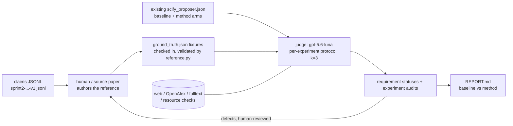

# Evaluation Harness v2 — Design

**Status:** implemented in `norm_cards/eval/`. This doc is the design of record; the
"Implementation notes" section at the end records what changed while building it.
**Supersedes:** `results/norm_cards_hybrid/ground_truth_recipes.md` (hand-written Fable-5
ground truths — scratched) and the manual scoring in `GRAND_REPORT_10claims.md`.

## Goal

An automated, evidence-grounded evaluation of the norm-card pipeline: score the
experiment sets produced by `scify_proposer.py` for **coverage, soundness, precision,
norm alignment and grounding** against the claim's true verify/refute decision
structure — so that pipeline changes can be measured as deltas on a fixed benchmark.

An *arm* is whatever is being contrasted: baseline vs method for the norm-card
ablation, or one arm per model for a proposer comparison. `report.py` discovers arms
from the judgment files rather than hardcoding them.

One agentic stage, over an input the harness does not produce:

| Piece | Model | Role |
|---|---|---|
| **Reference recipes** | none — **authored outside the harness** | The experiment chain a competent team would run to decide the claim. Hand-written, or transcribed from the source paper's experiment section. A checked-in fixture; `reference.py` validates and renders it. See `reference_format.md`. |
| **Evaluation** | `gpt-5.6-luna` (cheap/fast → judge-runs default 3) | Judges the SET against the claim's decision requirements, plus a per-experiment audit for soundness, norm alignment, grounding and economy. Evidence-quoted throughout. |

**Scope for now:** the 10 claims that have `scify_proposer.json`
(6, 7, 9, 10, 11, 12, 21, 33, 36, 37); the evaluator runs on those existing outputs.
The harness is test-case shaped: claims with a reference fixture are the test set.

**Why the reference is not machine-generated.** An earlier version of this design had a
Stage A that ran `gpt-5.6-sol` at `xhigh` effort to research each claim and write its
reference recipe. That was removed in August 2026 after review: a reference produced by
asking a strong model to design experiments for the claim is not an independent
standard, it is one more system's output — and if that model were reliable enough to
define correctness, the right move would be to ship it as the proposer instead of
scoring the proposer against it. The circularity also caps the measurable ceiling of the
pipeline at the reference model's own judgment. References now come from a person or a
paper, and each carries a `provenance` block that is rendered into the line the judge
sees, so a weakly-sourced reference is visibly weak at the point of use.

Everything downstream already assumed a fallible reference, so this change was additive
rather than disruptive.

**Why judging became set-level (August 2026).** The first version scored each proposed
experiment against the reference one at a time, with a `gt_triage` step (MATCH /
PARTIAL / NOVEL / CONTRADICTS) feeding a per-experiment verdict. That measures
presentation as much as substance: two competent teams will split, merge and reorder
the same work differently, and a proposer that covers everything in three experiments
where the reference used seven was structurally disadvantaged. The unit of judgment is
now the **requirement** — one per reference step, stating what has to be established —
and the judge maps the whole set onto the requirements many-to-many. One experiment may
carry three requirements; three may jointly carry one; order is irrelevant; a different
valid route to the same conclusion counts as satisfied.

The same change also demoted reference critique. When the reference was a machine
artifact the judge was actively encouraged to attack it. Now that it is transcribed
from a peer-reviewed paper, `reference_defects` is a narrow channel for material errors
only — a wrong threshold, a mis-stated claim — and an empty list is the expected
result. Credit for work *beyond* the reference moved to its own field,
`unmet_by_reference`, so a proposer is rewarded for closing a real gap without that
being framed as a complaint about the source.

## Core design principles

1. **The reference is authoritative about *what* must be decided, not about *how*.**
   A recipe transcribed from a paper records what one competent team did; it is a strong
   standard for the questions that have to be settled and no standard at all for the
   route taken to settle them. So the judge scores requirement satisfaction, never
   step matching, and divergence is explicitly not a fault. Any judgment that faults an
   experiment must still be backed by *independent* evidence (paper quotes, docs,
   leaderboards) — "the reference does it differently" is never sufficient.
2. **The judge's baseline is unaided; the tool belt is an extra.** `--tools` is OFF by
   default. What is being evaluated is the judge's own reading of the claim and the two
   lists, so that is what it is given. The belt (web search, page fetch, OpenAlex,
   full-text retrieval) is available where resource existence is genuinely at issue.
   This reversed an earlier "fully equipped, cost accepted" default, on evidence: in the
   judge stress suite the belt made the ORDER CONTROL — reversing a proposal list, which
   provably cannot change what the set establishes — drift by a mean |Δ| of 0.165
   against 0.069 unaided, and by 0.286 on one claim. Rate-limited searches return
   different evidence on different passes, and that variance lands straight in the
   score. A judge whose noise exceeds the effect being measured is not thorough, it is
   unusable.
3. **Every judgment quotes evidence.** A verdict without a quoted, attributable source is
   downgraded to `UNSUPPORTED` and excluded from headline scores.
4. **Judge the decision structure, not string similarity.** A proposed experiment that
   differs from the GT but genuinely advances the verify/refute decision is a
   `VALID_NOVEL`, not a miss. Coverage is scored over *roles* in the dependency chain
   (gate → apparatus → headline → control), not over GT line items.
5. **Everything is auditable.** Full tool-call trajectories (every query, every fetched
   page, every quote) are logged as JSONL traces so any verdict can be hand-checked.

---

## Shared infrastructure

### `norm_cards/eval/agent_loop.py` — generic tool-calling loop

The judge's runner (litellm function-calling, consistent with
`llm.py`):

```
run_agent(system, user, submit_spec, model, *, reasoning_effort,
          max_steps=200, trace_path, validate) -> AgentResult
```

- Standard OpenAI-style tool-calling loop: model ↔ tool executor until the model emits
  the final structured answer (a designated `submit_*` tool with a strict JSON schema —
  this is how we force valid output without truncating the research phase).
- `max_steps` is a safety valve, not a budget — set high (200), never advertised to the
  model. No token/time pressure in any prompt.
- `validate` rejections are handed *back to the agent* as a tool result, so a schema or
  evidence-discipline failure produces a corrected resubmission instead of a dead run.
- Every step appended to `trace.jsonl` with the full tool result. Results are also cached
  to disk (keyed by tool+args hash) so re-runs are cheap and evidence is reproducible.
- **`reasoning_effort` is always passed explicitly.** Verified live: the API rejects
  function tools on `/v1/chat/completions` when the parameter is *omitted*, but accepts
  every explicit level including `xhigh`. Omitting it is the one way to break the loop.
- **Evidence ledger + context compaction.** A `record_evidence(source, quote, bearing)`
  tool captures quotes the moment they're found; the ledger is pinned in context and
  never compacted, while raw tool results older than the last 6 shrink to a head slice
  once the transcript passes ~400k chars. This is what makes long research runs possible
  without the agent losing the quote it read eighty steps ago — and it enforces the
  "quote evidence" rule mechanically rather than by asking nicely in a prompt.

### `norm_cards/eval/tools.py` — the tool belt

All tools are **local functions** exposed via function-calling, not provider-native
search. Rationale: (a) works identically for any model family, (b) every query and
result is logged and cacheable → auditable evidence trail, (c) no dependence on what a
given provider's built-in browsing returns on a given day.

| Tool | Backing | Purpose |
|---|---|---|
| `web_search(query, n)` | SERP API (key already used by `sources/serp_scholar.py`) | General web: docs, leaderboards, blog posts, HF/Kaggle dataset pages. |
| `fetch_page(url)` | requests + readability extraction | Read a page found via search; returns cleaned text. |
| `openalex_search(query, n, lexical=False)` | wraps `sources/openalex.py` (`search` / `search_lexical`) | Scholarly search: titles, abstracts, venues, citation counts, DOIs, OA pdf urls. |
| `fetch_paper(id_or_url)` | wraps `fulltext.py` + `.pdfcache` | Full text of a paper (pdf → text) for quote extraction. |
| `check_resource(name, kind)` | HF Hub / Kaggle / PapersWithCode APIs | Existence + metadata check for a named dataset/model/metric ("does `coco-person-640` exist? what is YOLO11n's reported AP?"). Used heavily for groundedness. |

"Deep search" is emergent: the loop iterates search → fetch → search as long as it
wants. No separate deep-research API dependency (can be added later behind the same
tool interface if wanted).

---

## The reference recipe (`norm_cards/eval/reference.py`)

**An input, not a stage.** The harness has no code path that writes a reference recipe;
it validates one, renders it, and shows it to the judge. See
[`reference_format.md`](reference_format.md) for the field-by-field spec.

```
python -m norm_cards.eval.reference --template 7   # blank skeleton for problem 7
$EDITOR results/eval_v2/ground_truth/problem_7/ground_truth.json
python -m norm_cards.eval.reference --check        # validate + render markdown
```

**Where references come from:** a person writes one, or transcribes it from the
experiment section of the paper the claim was drawn from, or takes dictation from a
domain expert. Each records this in `provenance`, which is rendered into a single line
shown to the judge alongside the recipe.

**Structure retained from the generated version** (it was the part that worked): the
dependency chain **gate** (cheap prerequisite that can refute outright) → **apparatus**
(things the claim presupposes; build + validate) → **headline** (direct test, all stated
constraints enforced) → **control** (rule out artifacts / attribute the effect). Target
size **4–6 experiments**, adaptive not fixed, refute-first: early steps are cheap kills;
each later step assumes the earlier ones didn't already refute, and builds toward
proving the claim when disproving it wasn't straightforward. Each step carries id, role,
description, pass/fail criteria, resources, dependencies, and evidence for why it is
necessary and standard. `confidence` and `caveats` per step, plus a `self_critique`
list, tell the judge how much of the reference to lean on — a weakness recorded there is
one a divergent proposal will not be unfairly punished for.

**Validation split.** `--check` reports **errors** that block evaluation (3–8 steps; a
`headline` and a `gate` present; every step has an id, valid role, real `pass_criteria`
and `why_necessary`; `depends_on` resolves; non-empty `decision_logic` and
`claim_analysis.assertions`) and **warnings** that never block (missing provenance, thin
citations, uncited steps, empty self-critique). The split is deliberate: the errors are
defects that would make a comparison meaningless, while the warnings are about how much
weight a reference can bear — and a hand-written reference and a paper-transcribed one
carry their authority differently, so neither should be blocked over the shape of its
bibliography.

**Files:** `results/eval_v2/ground_truth/problem_<id>/ground_truth.json` (the fixture)
and `ground_truth.md` (rendered by `--check`; what you actually read).

---

## The evaluator (`norm_cards/eval/evaluate.py`)

**Input per claim:** the claim and its subclaims, the reference fixture, and one
experiment set per arm. Arms are read from `<source>/problem_<id>/scify_proposer.json`
— either the ablation keys (`baseline_experiments` / `method_experiments`) or an
`arms` dict keyed by model name, which is what `propose.py` writes for a model
comparison. The loop **assumes the reference exists** and fails fast if the fixture is
missing; it never generates or modifies one.

The judge is **blind to the arm**. It is never told whether a set came from the
baseline or the norm-card arm, which model produced it, or that another arm exists.

### What the judge is shown

1. The claim and the subclaims the proposer was given.
2. **Field norms** — the datasets, models, metrics and protocols the literature treats
   as standard for this question, each with a sourced quote, rendered by
   `reference.norms_block()` from the reference's own `field_norms`.
3. **Decision requirements** — `reference.requirements_table()`, one requirement per
   reference step: an id, a role, what would satisfy it, and what its failure means.
4. The full reference recipe, for context on why each requirement exists.
5. The proposed experiments, presented as an **unordered set**.

> **Why the field norms come from the reference and not from the pipeline.** The norm
> card the pipeline generates is the *treatment* in the norm-card ablation. Showing the
> judge the treatment would hand the method arm an automatic match on every norm-alignment
> call and quietly invalidate the comparison. The reference's `field_norms` are
> transcribed from the source paper, so they are independent of both arms.

### The rubric

**A. Requirement satisfaction — the primary judgment, set-level.** For every
requirement: `satisfied` / `partial` / `missing` / `not_required`, with the
contributing experiment indices in `satisfied_by` and a rationale. Mapping is
many-to-many. The judge is told explicitly that order does not matter, granularity does
not matter, and a different valid route to the same conclusion counts as satisfied.
`not_required` removes a requirement from the denominator, so it carries the heaviest
justification burden of any call in the schema.

**B. Soundness — per experiment, independent of the reference.** `sound` / `flawed` /
`invalid`: would this design produce the information it claims to?

**C. Norm alignment — per experiment, against the field norms.** `standard` /
`defensible` / `nonstandard`. `defensible` scores level with `standard`, because a
reasoned divergence is not worse than the norm; only divergence that breaks
comparability costs.

**D. Grounding — per experiment.** Existence and fitness are recorded separately for
every named resource.

**E. Economy — per experiment.** `redundant_with` another experiment in the set, or
`off_claim`.

Plus, at set level: functional `role_coverage` (judged by what the experiments *do*,
not by which requirement ids they matched), `decision_sufficiency`, `missing`,
`unmet_by_reference` (credit for closing a real gap the requirements do not cover) and
`reference_defects` (material errors only).

### The evidence discipline

Enforced in `schemas.validate_evaluation`, which rejects a submission and hands the
error back to the agent to resubmit. It has two tiers, because the two kinds of
negative judgment do not cost the same to justify:

- **Faulting an experiment** (`flawed` / `invalid` / `nonstandard` / `off_claim`)
  asserts an external fact, so it needs a verbatim quote *and* a reasoning chain of at
  least two inferences, and cannot rest on evidence tier `T0`.
- **Marking a requirement unmet** (`partial` / `missing`) asserts something about the
  set in front of the judge, which no web search can confirm. It needs a reasoning
  chain but no citation. Demanding quotes for absence would just push the judge toward
  calling things satisfied to dodge the burden.

`not_required` is the exception and needs both.

### Set-level scoring (per arm, per claim)

All arithmetic, in `scoring.py`; the model never returns a score.

| Metric | Definition |
|---|---|
| `coverage` | Role-weighted requirement satisfaction (satisfied 1.0 / partial 0.5 / missing 0). Roles weighted gate .30, headline .40, apparatus .15, control .15; requirements sharing a role split that role's weight, so a claim with four controls and one gate does not become a controls benchmark. `not_required` leaves the denominator. **The headline number, and invariant to how the proposer sliced its work.** |
| `role_fill` | Functional role coverage, computed from `role_coverage` and deliberately independent of the requirements. `role_fill` above `coverage` means the set is working somewhere the reference is silent — which is the readout on reference completeness. |
| `soundness` | Mean over experiments (sound 1.0 / flawed 0.5 / invalid 0). |
| `precision` | Fraction of experiments that earn their place: bear on some requirement or are credited in `unmet_by_reference`, and are not `off_claim`. Catches padding. |
| `norm_alignment` | Fraction not judged `nonstandard`. |
| `resource_existence` | Named resources that are real and obtainable. |
| `resource_fit` | Among those that exist, the fraction appropriate for their use. Conditional on existence on purpose — the old single `groundedness` ratio conflated "this dataset is imaginary" with "this dataset is real but wrong for the job", and penalised a set for naming more resources. |
| `redundancy_penalty` | Fraction duplicating another experiment in the same set. |
| `sufficiency_score` | sufficient 1.0 / sufficient_with_gaps 0.5 / insufficient 0. |

k independent judge runs (default 3) are majority-voted per requirement and per
experiment. No majority ⇒ `CONTESTED`, flagged for hand review rather than averaged
into a value no run supports, though the mean is carried so the item does not vanish.

### Judge-reliability measures (the gpt-5.5-judge lesson)

- **Structured protocol over holistic scoring** — the judge never emits one big score;
  every number is a composition of small, individually evidenced decisions.
- **Mandatory evidence + audit trace** — makes hand-spot-checking cheap.
- **Self-consistency by default** — `--judge-runs k`, **default 3** (luna is cheap and
  fast): per-experiment verdicts are majority-voted; 3-way disagreements flagged
  `CONTESTED` for hand review rather than silently averaged.
- **Blind arms** — the judge is never told whether a set came from the baseline or the
  norm-card arm, nor that a second arm exists. Removes the obvious thumb on the scale.
- **Calibration set before trusting** — `calibrate.py --template` emits every judged
  experiment with a blank `expected_verdict`; hand-label ~10 (clearly valid / clearly
  invalid / subtle) *without reading what the judge said*, then `calibrate.py` reports
  agreement. Gate: don't trust a full run below 8/10 with every miss explainable.
- **GT-defect channel** — systematic under-scoring shows up as valid experiments
  marked `CONTRADICTS`; forcing the judge to either produce independent evidence or
  file a GT defect removes the "GT-said-so" shortcut that sank the gpt-5.5 judge.

---

## The proposer and its arms (`norm_cards/scify_proposer.py`, `eval/propose.py`)

`scify_proposer.py` is a self-contained copy of SciFy's Proposer, resynced against
dryrun @400e677. Nothing is imported from that repo, so a run here is reproducible
from this one alone; the single deliberate divergence is the CPU/GPU/runtime
constraint block, dropped because the question is whether a norm card helps design the
*ideal* experiment set, not one fitted to an 8GB, 30-minute budget.

Three drifts had accumulated in the earlier hand-copy, all of which mattered:

- system and instance prompts are two messages rendered from Jinja templates, not one
  concatenated string;
- `current_evidence` is `dict[str, str]` upstream — a section name mapping to **prose**.
  The old copy built a nested dict and `str()`-ed it, so the proposer received a Python
  repr: `{'scientific_norm_card': {'Knowledge Editing': {'datasets': [...`. That is the
  shape in which a norm card reads as a bag of nouns, and it dropped every `role`,
  `direction` and protocol `detail` on the way — the proposer saw `"Causal Tracing"` and
  never `"add Gaussian noise to subject embeddings and restore activations to locate
  causal sites"`;
- the decomposition prompt was missing two of its six exemplars.

### The three conditions

`propose.py --arms` runs one arm per (model, condition). Conditions differ **only** in
`current_evidence`:

| condition | `current_evidence` | what it isolates |
|---|---|---|
| `nocard` | `{}` | what the model already knows |
| `retrieval` | top-ranked retrieved papers, titles + truncated abstracts | the presence of relevant literature |
| `card` | the curated norm card | the synthesis over that literature |

`retrieval` is not optional garnish. A norm card *is* a synthesis over retrieved
papers, so "card beats nocard" cannot distinguish the synthesis from the mere presence
of the papers it was built from. Beating `retrieval` at comparable context cost is the
bar that the extraction pipeline actually has to clear.

`--sections` narrows what the `card` condition shows (`resources`, `design`, or any
subset of the six keys), which turns *what should we keep in the card?* into a
measurement rather than a matter of taste: run an arm per subset and read which
sections carry the effect.

`--budget` varies SciFy's own "propose up to 3 experiments" cap. Leave it at 3 for any
headline number, and vary it only as a labelled diagnostic. The cap is **not** an
arithmetic ceiling — one arm reached 0.94 recall with 3 proposals against an
8-experiment reference, because the judge maps many-to-many — and it is not a confound
for a card-vs-nocard Δ either, since both arms get the same budget. It does bind on
what a card can add: with three slots, resource content displaces control conditions
the model would otherwise have proposed, which is the mechanism behind the v0.2 card's
negative Δ on controls and confounds.

## Reporting (`norm_cards/eval/report.py`)

Aggregates all judgment files into `results/eval_v2/REPORT.md`:

- Per-claim table: arm × {coverage, correctness, groundedness, redundancy, sufficiency}.
- Baseline-vs-method deltas with per-claim breakdown (the pipeline-improvement signal).
- GT-defect digest (feeds GT regeneration).
- `CONTESTED`/`UNSUPPORTED` items listed for hand review.
- Run metadata: models, judge-runs k, prompt variant, date — so reports across pipeline
  iterations are comparable.

## Directory layout

```
norm_cards/eval/
  __init__.py       # paths, judge config, claim + reference fixture loading
  agent_loop.py     # tool-calling loop, evidence ledger, compaction, trace/cache
  tools.py          # web_search, fetch_page, openalex_search, fetch_paper, check_resource
  schemas.py        # submit_evaluation schema, its validator (evidence discipline),
                    #   and the reference-recipe input gate
  prompts.py        # the judge's system prompt (the real spec of its behaviour)
  scoring.py        # verdicts/statuses -> numbers; majority vote across judge runs
  reference.py      # reference recipes as INPUT: --template <id> | --check
  evaluate.py       # judge CLI:  -m norm_cards.eval.evaluate --problems ... [--arms] [--judge-runs k]
  calibrate.py      # judge-vs-hand-labels agreement check (--template to start)
  report.py         # aggregate -> REPORT.md
results/eval_v2/
  ground_truth/problem_<id>/{ground_truth.json, ground_truth.md}
  judgments/problem_<id>/{baseline.json, method.json, <arm>.run<k>.trace.jsonl}
  calibration.json
  REPORT.md
```

Judge traces and the tool cache are gitignored (megabytes each, regenerable);
references and judgments are tracked, and every judgment carries its own evidence
ledger, so verdicts stay auditable from git alone. `ground_truth/` keeps its directory
name so existing paths and fixtures do not churn, but its contents are inputs now.

`results/norm_cards_hybrid/` is left untouched as the v1 record.

## Execution flow



## Implementation notes (what building it changed)

1. **`reasoning_effort` must be sent explicitly on every tool-calling request.** Omitting
   it makes the API reject function tools on `/v1/chat/completions`; every explicit level
   through `xhigh` works fine. This is the single easiest way to break the loop.
2. **The evidence ledger became load-bearing, not decorative.** `record_evidence` exists
   because long runs must compact old page text out of context; pinning the ledger is
   what makes that safe, and it simultaneously turns "quote your evidence" from a prompt
   request into a mechanism.
3. **Validation is the enforcement point.** `schemas.validate_evaluation` rejects any
   judgment that faults an experiment while lacking a quote *and* a ≥2-step chain, and hands
   the error back to the agent to fix. This is what stops the judge falling back on "the
   reference recipe disagrees" — the failure mode that made the gpt-5.5 judge unusable.
4. **Scoring moved entirely into code** (`scoring.py`). No agent ever emits a score; it
   emits verdicts and per-role coverage statuses, and the arithmetic happens outside the
   model.
5. **The judge runs blind to the arm.**
6. **The generated ground truth was removed after the fact** (August 2026). The
   generator ran, produced references for claims 7 and 11, and the harness was validated
   end-to-end against them before review rejected the premise. What survived is worth
   noting: the judge caught real defects in those machine-written references — 10 filed
   reference defects across two claims, including one where it sided with a proposed
   experiment over the reference on gate logic. That the fallible-reference machinery
   works is exactly why swapping in a better-sourced reference is a drop-in change.
7. **A local PDF space-recovery step** was added in `eval/tools.py` (retry extraction at
   `x_tolerance=1.0` when the space ratio is anomalously low — some arXiv PDFs otherwise
   extract as `77.5%oftheproblems`). Deliberately *not* patched into `fulltext.py`, which
   feeds the pipeline under evaluation and must not change while we measure it.

## Decisions (settled)

1. **Local tools over provider-native browsing** — for auditability and
   model-agnosticism (see tool-belt rationale).
2. **Current test set = the 10 claims with existing proposer outputs**, scored as-is
   (capped prompt, n=1 proposals). Uncapped proposer re-runs and the other 7 claims are
   future expansions that plug into the same harness.
3. **GT lifecycle is fully manual.** GT generation/regeneration is a human-invoked
   step (one-time, xhigh effort); the eval loop treats GT as immutable fixtures and
   errors out if one is missing. Reference defects from eval runs are the input a human
   reviews before deciding to regenerate a claim's GT.
4. **Judge runs default to 3** (luna is cheap); anything deck-bound additionally needs
   the proposer side replicated (v1 lesson: n=1, temp=1 results like #9/#21 are
   anecdotes until replicated).
